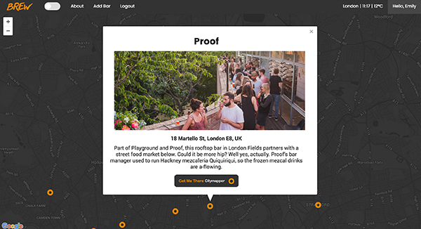

# BREW

###GA WDI London - Group Project 

####An API that stores information about rooftop bars across London, and a front-end that consumes it.

#####[View it here!](https://brew-rooftop-bars.herokuapp.com/ "Here!")

####The App

Users can create an account, and login with that account. Once a user is logged in, they have access to the map of bars, and can add a bar to the map. If user clicks on a pin, they can see the information about the bar, and are given a CityMapper link which gives them directions to it.

####The Build

* Built with Node, Express & MongoDB 
* Authentication with JWT
* Google Maps API
* Weather Underground API
* CityMapper
* The Google Web Font 'Poppins' has been used to style the webite.

####Packages Used
* express-jwt
* jsonwebtoken
* node-geocoder
* passport

####Problems & Challenges

The biggest challenge we faced with this project was implementing an authentication system between the API and the front-end app. We used JWT to authenticate a user, and local storage to store the token on the client side.

